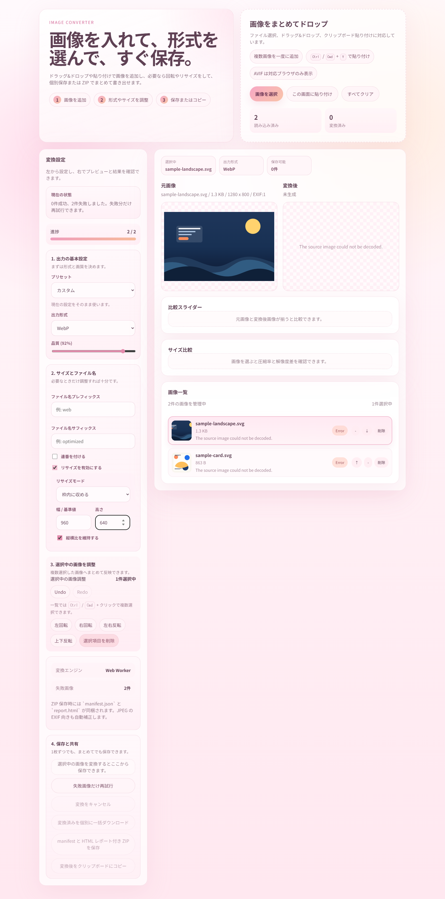
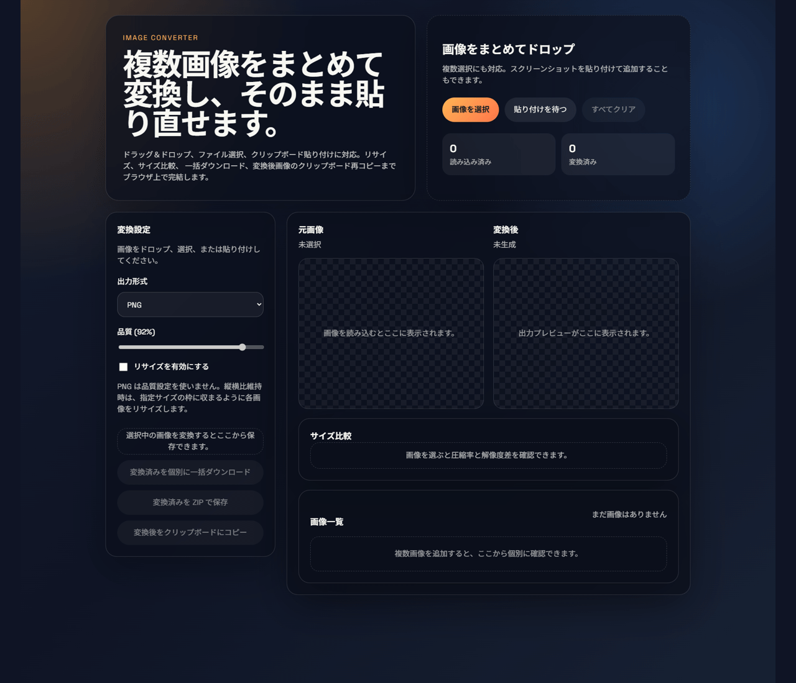
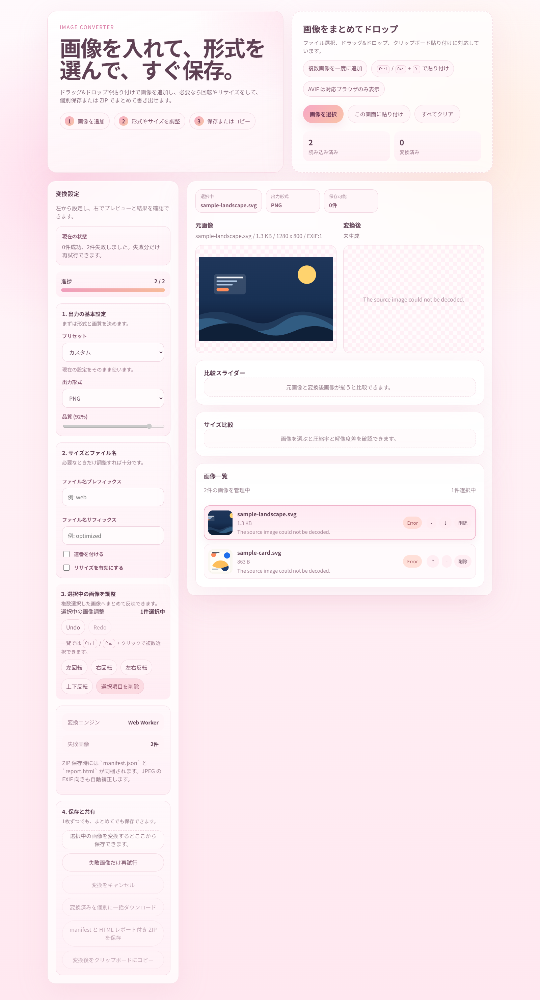
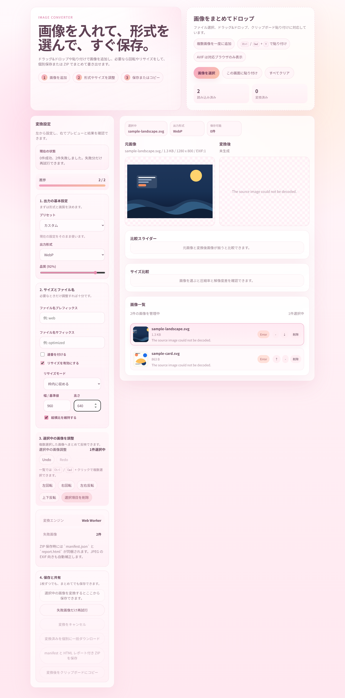
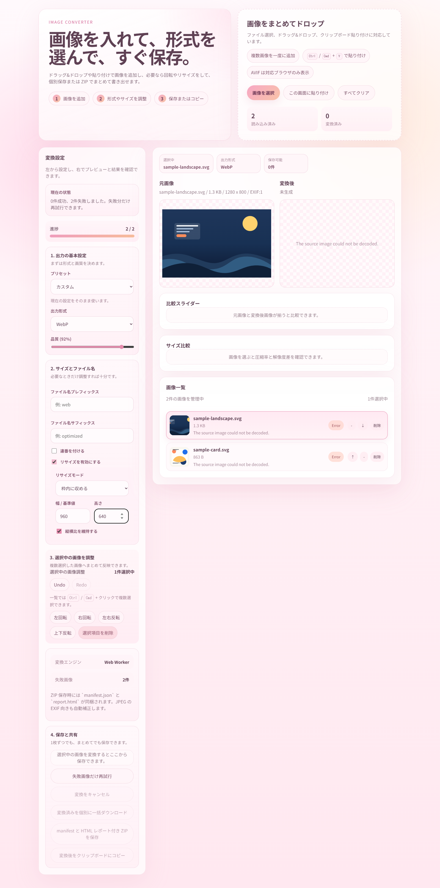

# Image Converter

React + Vite で作成した、ブラウザ完結型の画像変換アプリです。  
ドラッグ＆ドロップ、ファイル選択、クリップボード貼り付けから画像を取り込み、PNG / JPEG / WebP / AVIF へ変換できます。  
複数画像の一括変換、プリセット切り替え、`manifest.json` と `report.html` 付き ZIP 保存、Web Worker ベースのバックグラウンド変換に対応しています。  
さらに、ドラッグ並び替え、複数選択一括操作、Undo / Redo、JPEG 背景色指定、回転・反転、比較スライダー、失敗画像だけの再試行、変換進捗表示、JPEG の EXIF 向き補正、PWA 対応、変換キャンセル、出力ファイル名ルール、E2E テストも入っています。



## できること

- 複数画像の一括読み込みと一括変換
- PNG / JPEG / WebP / AVIF への変換
- 出力プリセット
- 画像一覧の並び替え
- ドラッグでの並び替え
- 複数選択一括操作
- Undo / Redo
- 変換前 / 変換後プレビュー
- 比較スライダー
- JPEG / WebP / AVIF の品質調整
- JPEG 背景色指定
- リサイズ指定
- リサイズモード切り替え
- 縦横比の維持 / 解除
- 選択画像の回転 / 反転
- 圧縮前後のサイズ比較
- 個別ダウンロード
- 個別ファイルの一括ダウンロード
- 出力ファイル名プレフィックス / サフィックス / 連番
- `manifest.json` 付き ZIP ひとまとめ保存
- `report.html` 付き ZIP レポート
- 変換後画像のクリップボード再コピー
- Web Worker による変換処理
- 変換進捗バー
- 変換キャンセル
- 失敗画像だけの再試行
- JPEG の EXIF 向き補正
- レスポンシブ対応 UI

## デモ

変換フローのイメージです。



## 画面イメージ

### 読み込み直後



### 設定変更中



### 出力アクション



## 対応形式

入力:

- ブラウザが読み込める画像ファイル
- クリップボード上の画像データ

出力:

- PNG
- JPEG
- WebP
- AVIF

## 主な仕様

- 画像変換はブラウザの `canvas` を使って実行します。
- サーバーアップロードなしで動作します。
- Worker が使える環境では、変換処理を Web Worker 側で実行します。
- Worker が使えない環境では、自動でメインスレッド変換にフォールバックします。
- 変換中は件数ベースの進捗を表示します。
- 変換中は `変換をキャンセル` で途中停止できます。
- 失敗した画像がある場合は、その画像だけ再試行できます。
- PNG は可逆圧縮のため、品質スライダーは実質無効です。
- JPEG は透過を保持できないため、透明部分は指定した背景色で合成して出力します。
- JPEG の EXIF Orientation を読み取り、可能な範囲で向きを自動補正します。
- AVIF はブラウザが出力エンコードに対応している場合のみ選択肢に表示されます。
- クリップボードへの画像書き込みは、対応ブラウザでのみ動作します。
- ZIP 保存では、変換済み画像を 1 つの `.zip` ファイルにまとめて保存し、あわせて `manifest.json` と `report.html` に設定値や変換前後サイズを記録します。
- リサイズ時は、指定サイズと縦横比設定に応じて出力解像度が変化します。

## リサイズモード

- `枠内に収める`: 指定した幅と高さの枠内に収まるように縮放します
- `正確なサイズ`: 指定した幅と高さへそのまま出力します
- `長辺基準`: 長辺を指定値へ合わせます
- `短辺基準`: 短辺を指定値へ合わせます
- `倍率指定`: 元画像に対してパーセントで拡大縮小します

## プリセット

- `カスタム`: 現在の設定をそのまま使います
- `Web用に軽量化`: WebP と 1600px ベースで軽量化します
- `SNS投稿向け`: JPEG と 1200px ベースで扱いやすいサイズにします
- `AVIF圧縮`: AVIF 対応環境で、保存サイズを重視して変換します

## 使い方

### 画像を変換する

1. 画像をドラッグ＆ドロップするか、`画像を選択` から読み込みます。
2. 必要なら `プリセット` を選びます。
3. `出力形式`、品質、リサイズモード、サイズ設定を調整します。
4. 必要なら一覧をドラッグ、または上下ボタンで順番を並び替えます。
5. 一覧から画像を選び、必要なら `Ctrl` / `Cmd` + クリックで複数選択します。
6. 回転 / 反転、削除、Undo / Redo を使って調整します。
7. JPEG 出力時は背景色も指定できます。
8. 必要なら出力ファイル名のプレフィックス、サフィックス、連番付与を設定します。
9. 変換後、個別ダウンロード・一括ダウンロード・ZIP 保存のいずれかで保存します。
10. 重い処理を止めたい場合は `変換をキャンセル` を使います。
11. 失敗画像がある場合は、`失敗画像だけ再試行` で再実行できます。

### クリップボード画像を使う

1. スクリーンショットなどをクリップボードにコピーします。
2. アプリ画面をアクティブにします。
3. `Ctrl + V` で貼り付けます。
4. 読み込まれた画像を通常どおり変換します。

### 変換後画像をクリップボードに戻す

1. 一覧から対象画像を選びます。
2. `変換後をクリップボードにコピー` を押します。
3. 対応アプリへ貼り付けます。

## セットアップ

```bash
npm install
```

## 開発サーバー

```bash
npm run dev
```

## 本番ビルド

```bash
npm run build
```

## テスト

```bash
npm run test
```

## E2E テスト

ローカルサーバー起動後に実行します。

```bash
npm run test:e2e
```

## README 用アセットの再生成

README に使用しているスクリーンショットと GIF は、先にローカルサーバーを起動したうえで次のスクリプトから再生成できます。

```bash
npm run dev -- --host 127.0.0.1 --port 4173
```

```bash
node ./scripts/capture-readme-assets.mjs
```

別ポートを使う場合は `APP_URL` 環境変数で変更できます。

生成先:

- `docs/readme/overview.png`
- `docs/readme/step-01-empty.png`
- `docs/readme/step-02-loaded.png`
- `docs/readme/step-03-settings.png`
- `docs/readme/step-04-actions.png`
- `docs/readme/workflow.gif`

サンプル入力画像:

- `docs/sample-inputs/sample-landscape.svg`
- `docs/sample-inputs/sample-card.svg`

## 技術スタック

- React 18
- Vite 5
- JSZip
- Playwright Core
- Web Worker
- Vitest
- Service Worker

## ディレクトリ構成

```text
image-converter/
├─ docs/
│  ├─ readme/
│  └─ sample-inputs/
├─ public/
│  ├─ icon.svg
│  ├─ manifest.webmanifest
│  └─ sw.js
├─ src/
│  ├─ conversion.js
│  ├─ imageConverter.worker.js
│  ├─ conversion.test.js
│  ├─ report.js
│  ├─ report.test.js
│  ├─ App.jsx
│  ├─ main.jsx
│  └─ styles.css
├─ scripts/
│  ├─ capture-readme-assets.mjs
│  └─ e2e.mjs
├─ index.html
├─ package.json
├─ vitest.config.js
└─ vite.config.js
```
